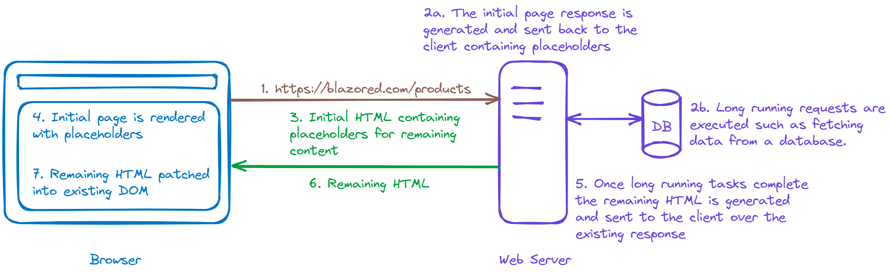

# Blazor 

## 服务端渲染
SSR Server Side Rendering 服务端渲染，页面内容在服务器上已经渲染成 html 发送给浏览器


如何配置

在应用入口方法中开启如下操作
```csharp
// 添加服务端渲染需要的组件服务
builder.Services.AddRazorComponents();

// 发现可路由的组件并注册到端点上
app.MapRazorComponents<App>(); 
```

## 流式渲染
SR Streaming Rending 流式渲染，当一个页面包含需要花费时间等待加载的数据式，可以先加载一个基本的页面内容，
然后等到数据准备完成后在同一个连接中把后续的更新内容更新到页面



如何设置流式渲染

在组件文件的头部添加一下属性标记

```csharp
@attribute [StreamRendering(true)]
```

## 交互模式

参考文档 [ASP.NET Core Blazor render modes](https://learn.microsoft.com/en-us/aspnet/core/blazor/components/render-modes?view=aspnetcore-8.0)
| Name                    | Description                                                                                                           | Render location    | Interactive |
|-------------------------|-----------------------------------------------------------------------------------------------------------------------|--------------------|-------------|
| Static Server           | Static server-side rendering (static SSR)                                                                             | Server             | ❌           |
| Interactive Server      | Interactive server-side rendering (interactive SSR)                                                                   | Server             | ✅           |
| Interactive WebAssembly | Client-side rendering (CSR) using Blazor WebAssembly                                                                  | Client             | ✅           |
| Interactive Auto        | Interactive SSR using Blazor Server initially and then CSR on subsequent visits after the Blazor bundle is downloaded | Server then Client | ✅           |
